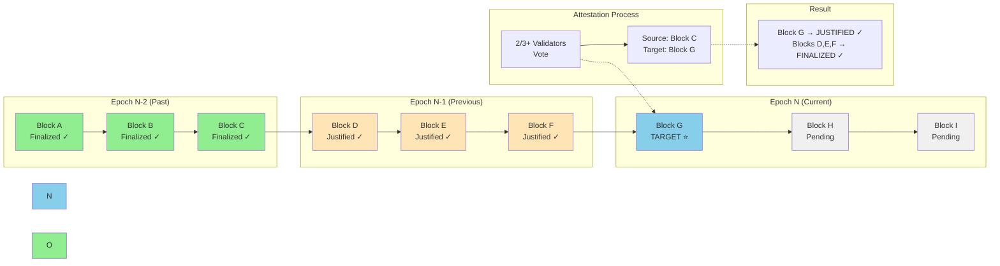

```mermaid
graph LR
    subgraph "Epoch N-2 (Past)"
        A[Block A<br/>Finalized ✓] --> B[Block B<br/>Finalized ✓] --> C[Block C<br/>Finalized ✓]
    end
    
    subgraph "Epoch N-1 (Previous)"
        C --> D[Block D<br/>Justified ✓] --> E[Block E<br/>Justified ✓] --> F[Block F<br/>Justified ✓]
    end
    
    subgraph "Epoch N (Current)"
        F --> G[Block G<br/>TARGET ⭐] --> H[Block H<br/>Pending] --> I[Block I<br/>Pending]
    end
    
    subgraph "Attestation Process"
        J[2/3+ Validators<br/>Vote] --> K[Source: Block C<br/>Target: Block G]
    end
    
    subgraph "Result"
        L[Block G → JUSTIFIED ✓<br/>Blocks D,E,F → FINALIZED ✓]
    end
    
    J -.-> G
    K -.-> L
    
    style A fill:#90EE90
    style B fill:#90EE90
    style C fill:#90EE90
    style D fill:#FFE4B5
    style E fill:#FFE4B5
    style F fill:#FFE4B5
    style G fill:#87CEEB
    style H fill:#F0F0F0
    style I fill:#F0F0F0
    style N fill:#87CEEB
    style O fill:#90EE90
    
    classDef finalized fill:#90EE90,stroke:#006400,stroke-width:2px
    classDef justified fill:#FFE4B5,stroke:#FF8C00,stroke-width:2px
    classDef target fill:#87CEEB,stroke:#4169E1,stroke-width:2px
    classDef pending fill:#F0F0F0,stroke:#808080,stroke-width:1px
```
