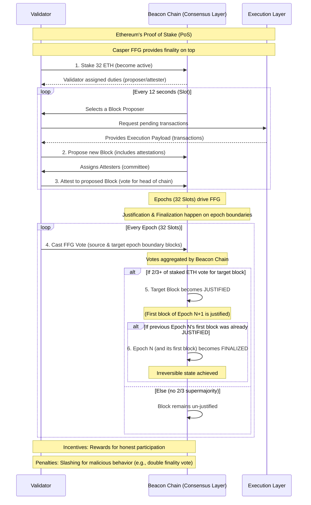

# Understanding Casper FFG in Ethereum Consensus

This diagram illustrates the simplified flow of how Casper the Friendly Finality Gadget (FFG) contributes to Ethereum's Proof of Stake (PoS) consensus, focusing on the justification and finalization of blocks and epochs.

## Sequence Diagram

## Explanation of Steps

### 1. Stake 32 ETH
To become a validator, an entity must stake 32 ETH on the Beacon Chain.

### 2. Propose new Block
A randomly selected validator proposes a new block, which includes transactions from the Execution Layer and attestations from other validators.

### 3. Attest to proposed Block
Other validators in assigned committees attest to the validity of the proposed block, effectively voting for it as the head of the chain.

### 4. Cast FFG Vote
At the end of each epoch, validators cast specific Casper FFG votes, targeting the first block of the current epoch (as the "target") and the last justified block they know (as the "source").

### 5. Target Block becomes JUSTIFIED
If a block receives votes from over 2/3 of the total staked ETH, it becomes "justified." This is a strong indication of agreement.

### 6. Epoch becomes FINALIZED
If a block (representing the start of an epoch) is justified, and the next epoch's starting block is also justified, then the first epoch (and all its blocks) becomes "finalized." This state is considered irreversible.

## Summary

Casper FFG, through this voting and justification mechanism, provides the strong "finality" guarantee that is crucial for the security and usability of the Ethereum network.