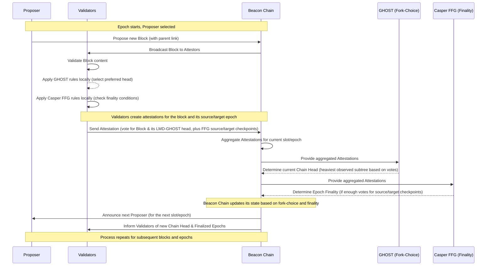

```mermaid
sequenceDiagram
    participant P as Proposer
    participant V as Validators
    participant BC as Beacon Chain
    participant GHOST as GHOST (Fork-Choice)
    participant CFFG as Casper FFG (Finality)

    Note over P, BC: Epoch starts, Proposer selected

    P->>BC: Propose new Block (with parent link)
    BC->>V: Broadcast Block to Attestors
    V->>V: Validate Block content
    V-->>V: Apply GHOST rules locally (select preferred head)
    V->>V: Apply Casper FFG rules locally (check finality conditions)

    Note over V, BC: Validators create attestations for the block and its source/target epoch

    V->>BC: Send Attestation (vote for Block & its LMD-GHOST head, plus FFG source/target checkpoints)
    BC->>BC: Aggregate Attestations for current slot/epoch
    BC->>GHOST: Provide aggregated Attestations
    GHOST-->>BC: Determine current Chain Head (heaviest observed subtree based on votes)

    BC->>CFFG: Provide aggregated Attestations
    CFFG-->>BC: Determine Epoch Finality (if enough votes for source/target checkpoints)

    Note over BC: Beacon Chain updates its state based on fork-choice and finality

    BC->>P: Announce next Proposer (for the next slot/epoch)
    BC->>V: Inform Validators of new Chain Head & Finalized Epochs

    Note over P, BC: Process repeats for subsequent blocks and epochs
```
