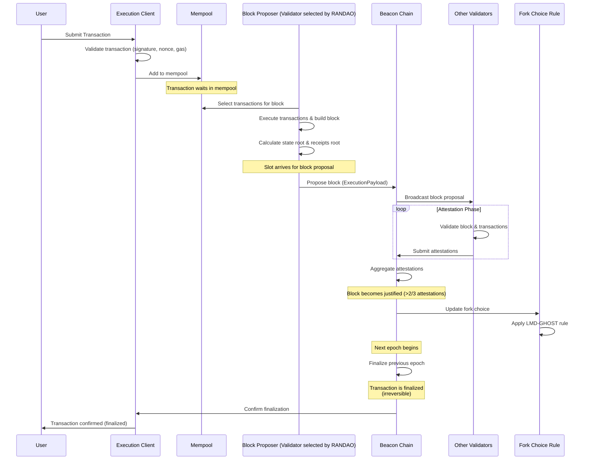

```mermaid
    sequenceDiagram
    participant User
    participant ExecutionClient as Execution Client
    participant Mempool
    participant Proposer as Block Proposer (Validator selected by RANDAO)
    participant BeaconChain as Beacon Chain
    participant Validators as Other Validators
    participant Fork as Fork Choice Rule

    User->>ExecutionClient: Submit Transaction
    ExecutionClient->>ExecutionClient: Validate transaction (signature, nonce, gas)
    ExecutionClient->>Mempool: Add to mempool
    
    Note over Mempool: Transaction waits in mempool
    
    Proposer->>Mempool: Select transactions for block
    Proposer->>Proposer: Execute transactions & build block
    Proposer->>Proposer: Calculate state root & receipts root
    
    Note over Proposer: Slot arrives for block proposal
    
    Proposer->>BeaconChain: Propose block (ExecutionPayload)
    BeaconChain->>Validators: Broadcast block proposal
    
    loop Attestation Phase
        Validators->>Validators: Validate block & transactions
        Validators->>BeaconChain: Submit attestations
    end
    
    BeaconChain->>BeaconChain: Aggregate attestations
    
    Note over BeaconChain: Block becomes justified (>2/3 attestations)
    
    BeaconChain->>Fork: Update fork choice
    Fork->>Fork: Apply LMD-GHOST rule
    
    Note over BeaconChain: Next epoch begins
    
    BeaconChain->>BeaconChain: Finalize previous epoch
    
    Note over BeaconChain: Transaction is finalized<br/>(irreversible)
    
    BeaconChain->>ExecutionClient: Confirm finalization
    ExecutionClient->>User: Transaction confirmed (finalized)
```
